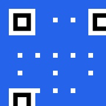

# QR Code Generator PWA

A simple, fast, and privacy-focused Progressive Web App for generating QR codes from URLs. Optimized for iOS devices with offline support.



## ✨ Features

- 🔗 **URL to QR Code** - Convert any URL into a scannable QR code
- 📱 **iOS Optimized** - Native-like experience on iPhone and iPad
- 📴 **Offline Support** - Works without internet after first load
- 💾 **Download QR Codes** - Save as high-quality PNG images
- 🎯 **Touch Friendly** - 56px minimum touch targets for mobile
- 🔒 **Privacy First** - All processing happens locally on your device
- ⚡ **Fast Generation** - QR codes generated in under 100ms

## 🚀 Quick Start

### Option 1: Local Development
```bash
# Clone the repository
git clone <repository-url>
cd QrGenerator

# Start local server
python3 -m http.server 8000

# Open in browser
open http://localhost:8000
```

### Option 2: Install as PWA on iOS
1. Open the app in Safari on your iOS device
2. Tap the **Share** button
3. Select **"Add to Home Screen"**
4. Tap **"Add"** to install

## 📱 How to Use

1. **Enter a URL** in the input field (e.g., `https://example.com`)
2. **Tap "Generate QR Code"** to create your QR code
3. **View the QR code** displayed in the app
4. **Tap "Download Image"** to save the QR code as a PNG file

## 🛠️ Technical Stack

- **HTML5** - Semantic markup with PWA meta tags
- **CSS3** - Responsive design with iOS safe areas
- **JavaScript** - ES6+ with QRCode.js integration
- **QRCode.js** - Reliable QR code generation library
- **Service Worker** - Offline caching and PWA functionality

## 📁 Project Structure

```
QrGenerator/
├── index.html          # Main HTML file with PWA meta tags
├── manifest.json       # PWA configuration
├── style.css          # iOS-optimized responsive styles
├── qr-generator.js     # Main application logic
├── qrcode.min.js       # QRCode.js library (19.9KB)
├── sw.js              # Service worker for offline support
├── icon.jpg           # App icon (180x180px)
├── spec.md            # Technical specification
└── README.md          # This file
```

## 🔧 Configuration

The app uses the following QR code settings:
- **Size:** 256x256 pixels
- **Format:** PNG
- **Error Correction:** High (Level H)
- **Colors:** Black on white for maximum compatibility

## 🌐 Browser Support

- ✅ **iOS Safari** (Optimized)
- ✅ **Chrome Mobile**
- ✅ **Firefox Mobile**
- ✅ **Desktop Browsers** (Chrome, Firefox, Safari, Edge)

## 🔒 Privacy & Security

- **No Data Collection** - No analytics, tracking, or data collection
- **Local Processing** - All QR generation happens on your device
- **No External APIs** - No data sent to external servers
- **URL Validation** - Input sanitization and security validation
- **Local Storage Only** - Service worker caches files locally

## 📋 Requirements Met

This PWA meets all modern web standards:
- ✅ **Progressive Web App** - Installable with offline support
- ✅ **Responsive Design** - Works on all screen sizes
- ✅ **Accessibility** - Screen reader support and keyboard navigation
- ✅ **Performance** - Fast loading and smooth interactions
- ✅ **Security** - HTTPS ready and secure by default

## 🎨 Design Features

- **Material Design** inspired interface
- **Gradient backgrounds** for visual appeal
- **Smooth animations** and transitions
- **Loading states** for better UX
- **Error handling** with clear messaging
- **Success feedback** for user actions

## 🧪 Testing

The app has been tested for:
- QR code generation accuracy
- Download functionality across browsers
- Responsive design on various screen sizes
- PWA installation process
- Offline functionality
- URL validation with edge cases

## 📄 License

This project is open source and available under the [MIT License](LICENSE).

## 🤝 Contributing

Contributions are welcome! Please feel free to submit issues or pull requests.

## 📞 Support

For questions or issues, please create an issue in the repository.

---

**Made with ❤️ for iOS users who need quick QR code generation**